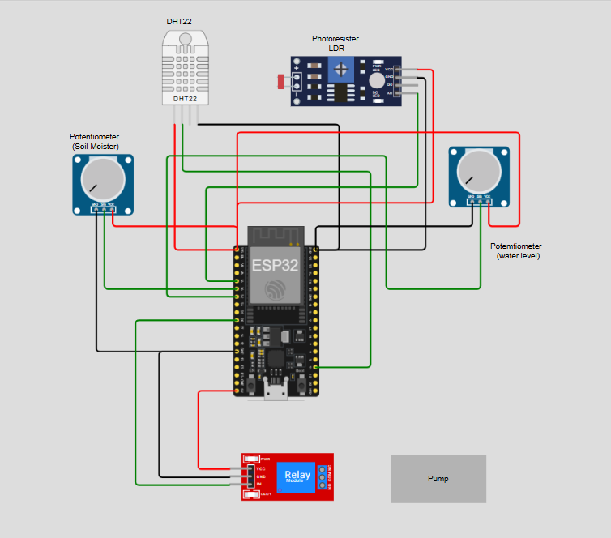

# 🌱 IoT Smart Agriculture Monitoring System

A Smart Agriculture Monitoring System that simulates real-time agricultural field monitoring using IoT concepts. The project collects environmental parameters such as temperature, humidity, soil moisture, light intensity, and water level, analyzes the data, generates alerts, and provides irrigation recommendations through an interactive dashboard.

---

## 📌 Project Overview

Traditional farming often relies on manual observation, which can lead to inefficient water usage and delayed responses to environmental changes. This project demonstrates how IoT-based monitoring can help farmers make data-driven decisions by continuously tracking field conditions.

The system simulates sensor readings, stores data in CSV format, analyzes sensor values, generates alerts, and visualizes trends through a Streamlit dashboard.

---

## 🎯 Objectives

* Monitor environmental conditions in agricultural fields.
* Track soil moisture levels for irrigation management.
* Monitor water reservoir levels.
* Generate alerts when abnormal conditions occur.
* Provide irrigation recommendations.
* Visualize historical sensor data through interactive charts.
* Demonstrate IoT-based smart farming concepts.

---

## ✨ Features

### 🌡 Environmental Monitoring

* Temperature Monitoring
* Humidity Monitoring
* Light Intensity Monitoring

### 🌱 Soil Monitoring

* Soil Moisture Tracking
* Irrigation Recommendation System

### 🚰 Water Management

* Water Level Monitoring
* Pump Control Logic

### 🚨 Alert System

* High Temperature Alerts
* Low Soil Moisture Alerts
* Low Water Level Alerts

### 📊 Data Analytics

* Historical Trend Analysis
* Alert Frequency Analysis
* Pump Activity Analytics
* Dataset Statistics

### 🖥 Dashboard

* Interactive Streamlit Dashboard
* Real-Time Status Cards
* Professional Visualizations
* Decision Support Recommendations

---

# 🏗 System Architecture

### Workflow

```text
Sensors
(Temperature, Humidity, Soil Moisture,
Light Intensity, Water Level)
            │
            ▼
Data Collection Layer
(simulator.py)
            │
            ▼
CSV Storage
(sensor_data.csv)
            │
            ▼
Analytics & Alert Engine
(alerts.py)
            │
            ▼
Decision Logic
(Pump ON/OFF)
            │
            ▼
Streamlit Dashboard
            │
            ▼
Farmer / User
```

---

# 🔌 Hardware Architecture



### Components Used

| Component                        | Purpose                           |
| -------------------------------- | --------------------------------- |
| ESP32 DevKit V1                  | Main Controller                   |
| DHT22                            | Temperature & Humidity Monitoring |
| Photoresistor (LDR)              | Light Intensity Monitoring        |
| Soil Moisture Sensor (Simulated) | Soil Monitoring                   |
| Water Level Sensor (Simulated)   | Water Reservoir Monitoring        |
| Relay Module                     | Pump Control                      |
| Water Pump                       | Automated Irrigation              |

---

# 🛠 Technology Stack

### Programming Languages

* Python
* C++

### Libraries & Frameworks

* Streamlit
* Pandas
* Plotly
* NumPy

### IoT Tools

* ESP32
* Arduino IDE
* Wokwi Simulator

### Data Storage

* CSV Files

---

# 📂 Project Structure

```text
IoT-Smart-Agriculture-Monitoring-System/

│
├── arduino_code/
│   └── smart_agriculture.ino
│
├── python_simulation/
│   ├── simulator.py
│   ├── dashboard.py
│   └── alerts.py
│
├── dashboard/
│   └── screenshots/
│
├── data/
│   └── sensor_data.csv
│
├── outputs/
│   └── reports/
│
├── images/
│   ├── architecture.png
│   ├── dashboard.png
│   └── simulation.png
│
├── circuit_diagram/
│   └── wokwi_design.png
│
├── docs/
│   └── project_report.pdf
│
├── requirements.txt
├── README.md
└── main.py
```

---

# 📊 Dataset Description

The dataset contains simulated sensor readings collected from agricultural field sensors.

| Feature      | Description           |
| ------------ | --------------------- |
| Time         | Timestamp             |
| Temperature  | Temperature in °C     |
| Humidity     | Relative Humidity (%) |
| SoilMoisture | Soil Moisture (%)     |
| Light        | Light Intensity       |
| WaterLevel   | Water Tank Level (%)  |
| Pump         | Pump Status (ON/OFF)  |
| Alert        | Alert Condition       |

### Sample Data

| Time             | Temp | Humidity | Soil Moisture | Water Level |
| ---------------- | ---- | -------- | ------------- | ----------- |
| 2025-06-01 10:00 | 30   | 65       | 45            | 70          |
| 2025-06-01 10:05 | 31   | 63       | 42            | 68          |

---

# ⚙ Installation

### Clone Repository

```bash
git clone https://github.com/yourusername/IoT-Smart-Agriculture-Monitoring-System.git
cd IoT-Smart-Agriculture-Monitoring-System
```

### Create Virtual Environment

```bash
python -m venv venv
```

### Activate Virtual Environment

#### Windows

```bash
venv\Scripts\activate
```

#### Linux/Mac

```bash
source venv/bin/activate
```

### Install Dependencies

```bash
pip install -r requirements.txt
```

---

# ▶ Running the Project

## Generate Sensor Data

```bash
python python_simulation/simulator.py
```

---

## Run Alert Engine

```bash
python python_simulation/alerts.py
```

---

## Launch Dashboard

```bash
streamlit run python_simulation/dashboard.py
```

---

# 📈 Dashboard Modules

### 📊 System Overview

Displays latest sensor readings.

### 🌾 Farm Health Status

Provides current field condition assessment.

### 🤖 Irrigation Recommendation

Suggests irrigation based on soil moisture levels.

### 🚨 Alert Management

Displays active alerts and historical alert patterns.

### 🚿 Pump Analytics

Shows irrigation pump usage statistics.

### 📉 Trend Analysis

Visualizes changes in sensor readings over time.

---

# 📊 Results

The system successfully:

* Simulates agricultural sensor readings.
* Monitors environmental conditions.
* Detects abnormal situations.
* Generates alerts automatically.
* Recommends irrigation actions.
* Visualizes sensor trends.
* Demonstrates IoT-based farming automation.

---

# 🔮 Future Enhancements

* Real Sensor Integration
* MQTT Communication
* Cloud Data Storage
* Mobile Application
* Machine Learning-Based Irrigation Prediction
* Weather API Integration
* SMS/Email Alerts
* Remote Pump Control

---

# 🎓 Learning Outcomes

Through this project, the following concepts were explored:

* Internet of Things (IoT)
* Sensor Data Acquisition
* Smart Agriculture
* Data Analytics
* Automation Systems
* Streamlit Dashboard Development
* ESP32 Programming
* Agricultural Monitoring Systems

---

# 👨‍💻 Author

**Samreen Begum**

IoT | Python | Data Analytics | Smart Agriculture

---

# 🙏 Acknowledgements

Special thanks to my mentor for guidance and support throughout the development of this project.

---

# ⭐ If you found this project useful

Please consider giving the repository a star and sharing your feedback. 🌟
